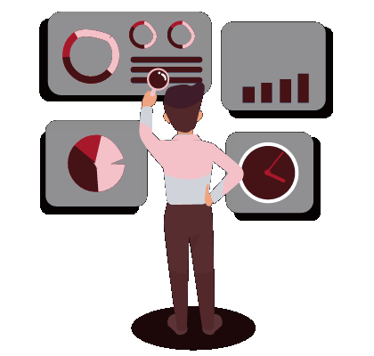

<div align="center">


[**pufferfish.vercel.app**](https://pufferfish.vercel.app) &nbsp;&nbsp; [LinkedIn](https://www.linkedin.com/in/mambuwu) &nbsp;&nbsp; [Telegram](https://t.me/mambuwu) &nbsp;&nbsp; [Instagram](https://instagram.com/mambuwu)

</div>

<div align="center"></div>

## about



```yaml
name: Kendrick
school: Singapore Polytechnic, Applied AI & Analytics
building: [ML experiments, full-stack apps, tools that feel like toys]
open_to: [internships, collaborations]
```

I build because I love the process. Sometimes that's a supervised
learning pipeline, sometimes a WebGL ocean, sometimes a CLI tool
I'll forget I made in a week. Off-keyboard: minecraft, badminton, sleep.

<br clear="right"/>

<div align="center"></div>

## stack

<div align="center">


</div>

## things i've built

<div align="center">

<a href="https://github.com/pufferfish3e/Luminent"></a>
<a href="https://github.com/pufferfish3e/vibefy-mood-app"></a>

<a href="https://github.com/pufferfish3e/BibleGuessr"></a>
<a href="https://github.com/pufferfish3e/practiceme"></a>

<a href="https://github.com/pufferfish3e/pomodoro"></a>
<a href="https://github.com/pufferfish3e/data-cleaning-workflow"></a>

</div>

<div align="center"></div>

## github, in numbers

<div align="center">

<a href="https://github.com/pufferfish3e"></a>
<a href="https://github.com/pufferfish3e?tab=repositories"></a>

<br/><br/>

<picture>
  <source media="(prefers-color-scheme: dark)" srcset="https://raw.githubusercontent.com/pufferfish3e/pufferfish3e/output/snake-dark.svg"/>
  <source media="(prefers-color-scheme: light)" srcset="https://raw.githubusercontent.com/pufferfish3e/pufferfish3e/output/snake.svg"/>
  
</picture>

</div>

<div align="center"></div>

<div align="center">

## let's talk

Open to internships, collaborations and good conversations.

[**Say hi on LinkedIn**](https://www.linkedin.com/in/mambuwu)

<br/>


</div>
