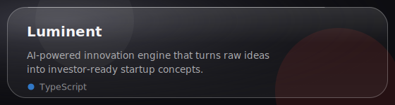
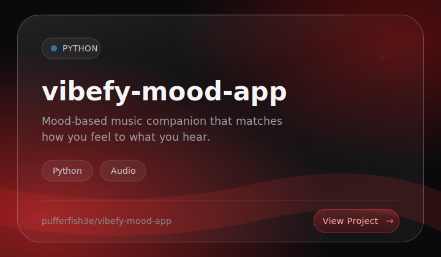
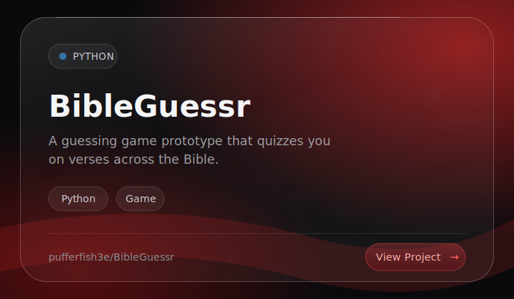
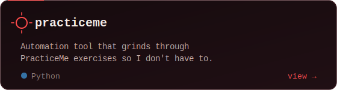
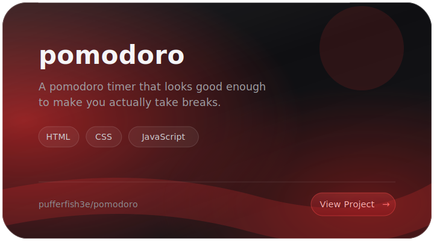
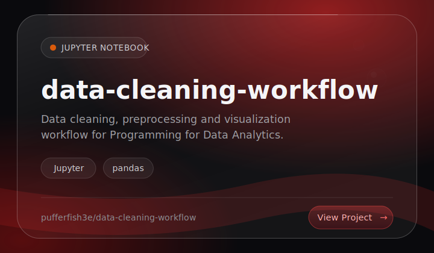

<div align="center">

<!-- banner -->


<!-- typing animation -->
<a href="https://github.com/pufferfish3e">

</a>

<br/>

<!-- socials -->
<a href="https://www.linkedin.com/in/mambuwu"></a>
&nbsp;
<a href="https://instagram.com/mambuwu"></a>
&nbsp;
<a href="https://t.me/mambuwu"></a>
&nbsp;
<a href="https://discord.com/users/798128584401223710"></a>
&nbsp;
<a href="https://pufferfish.vercel.app"></a>

<br/><br/>


</div>

<div align="center"></div>

## ✦ about me

```yaml
name: Kendrick
school: Singapore Polytechnic — Applied AI & Analytics
vibe: curious builder of code, creativity and chaos
philosophy: "i build because i love the process."
currently: [training models, breaking prod, respawning]
recharges_with: [minecraft, badminton, sleep]
```

I build **AI & ML experiments**, **full-stack apps** and **glitchy side projects on purpose** —
whether it's a vibe-coded toy, a brainrot game, or a CLI tool I'll forget I made in a week.

<div align="center"></div>

## ✦ skills & technologies

<div align="center">

**languages & core**


     

**ai & data**


      

**full-stack**


     

**ai tooling & automation**


  

</div>

<div align="center"></div>

## ✦ things i've built

<div align="center">

<a href="https://github.com/pufferfish3e/Luminent"></a>
<a href="https://github.com/pufferfish3e/vibefy-mood-app"></a>

<a href="https://github.com/pufferfish3e/BibleGuessr"></a>
<a href="https://github.com/pufferfish3e/practiceme"></a>

<a href="https://github.com/pufferfish3e/pomodoro"></a>
<a href="https://github.com/pufferfish3e/data-cleaning-workflow"></a>

</div>

<div align="center"></div>

## ✦ a little more about me — click to open

<details>
<summary><b>what i obsess over</b></summary>
<br/>

- AI & ML — models that surprise me are the best kind
- Systems that do weird things *on purpose* — glitch as a feature
- Interfaces with actual motion & feel — GSAP, R3F, the works
- Fast-paced learning and late-night coding sessions

</details>

<details>
<summary><b>what i'm building</b></summary>
<br/>

- My portfolio at [pufferfish.vercel.app](https://pufferfish.vercel.app) — a fullscreen WebGL ocean, obviously
- Luminent — turning raw ideas into investor-ready startup concepts
- Whatever hackathon happens to be on that weekend

</details>

<details>
<summary><b>outside of tech</b></summary>
<br/>

- Minecraft — redstone counts as engineering, i will not be taking questions
- Badminton — cardio with plausible deniability
- Sleep — the most underrated dev tool

</details>

<div align="center"></div>

## ✦ github, in numbers

<div align="center">

<a href="https://github.com/pufferfish3e"></a>
<a href="https://github.com/pufferfish3e?tab=repositories"></a>

<br/><br/>

<picture>
  <source media="(prefers-color-scheme: dark)" srcset="https://streak-stats.demolab.com?user=pufferfish3e&hide_border=true&background=00000000&ring=ff4b4b&fire=c1121f&currStreakLabel=ff4b4b&currStreakNum=ffffff&sideNums=ffffff&sideLabels=ff8080&dates=9f9f9f"/>
  
</picture>

</div>

<div align="center"></div>

## ✦ snake break

*watch it munch through my commits*

<div align="center">
<picture>
  <source media="(prefers-color-scheme: dark)" srcset="https://raw.githubusercontent.com/pufferfish3e/pufferfish3e/output/snake-dark.svg"/>
  <source media="(prefers-color-scheme: light)" srcset="https://raw.githubusercontent.com/pufferfish3e/pufferfish3e/output/snake.svg"/>
  
</picture>
</div>

<div align="center"></div>

<div align="center">

## ✦ let's talk

open to **internships**, **collaborations** and **good conversations** —
i respond faster than my CI pipeline

<a href="https://www.linkedin.com/in/mambuwu"></a>

<br/><br/>

🐡 *psst… the tank is alive — wait for the puff* 🐡



*made with too much caffeine and just the right amount of chaos*

</div>

---
